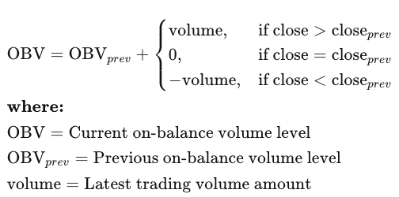

# On-Balance-Volume

On-Balance Volume (OBV) is a technical indicator that connects price movement with volume, aiming to reveal the strength or weakness behind price changes. The fundamental idea behind OBV is that significant price movements should be confirmed by volume.

OBV often used to:
* **Confirm Trends**
* **Detect Divergence**
* **Spot Breakouts**

Calculation:



### Environment

```BASH
pyenv local 3.11.3
python -m venv .venv
source .venv/bin/activate
pip install --upgrade pip
```
